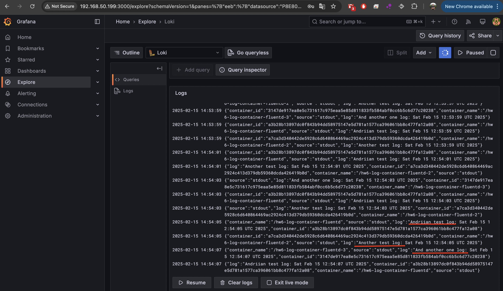
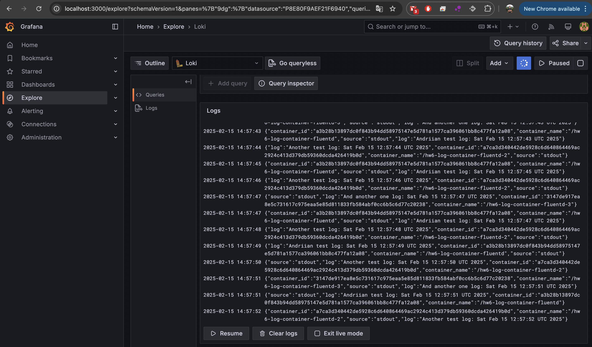

# HW6: Docker Logging

## Створення середовища

```sh
mkdir HW6-docker-logging
cd HW6-docker-logging/
```

## Створення мережі Docker
```sh
sudo docker network create -d bridge hw6-network
sudo docker network ls
```

Результат виводу:
```
NETWORK ID     NAME          DRIVER    SCOPE
167dfb0f4a35   bridge        bridge    local
308b88814943   host          host      local
3f6c98a228ab   hw5-bridge    bridge    local
f519f92ed808   hw6-network   bridge    local
5a39af71d31e   macvlan       macvlan   local
eafa12d960de   none          null      local
```

## Створення та збірка Fluentd
```sh
touch Dockerfile
mcedit Dockerfile 
sudo docker build -t hw6-fluentd .
```

## Налаштування конфігурації Fluentd
```sh
touch fluentd.conf
mcedit fluentd.conf 
```

## Перевірка наявності образу
```sh
sudo docker images
```

Результат виводу:
```
REPOSITORY                    TAG       IMAGE ID       CREATED              SIZE
hw6-fluentd                   latest    224d469289ff   About a minute ago   230MB
alpine                        latest    b5e85fce5ecf   45 hours ago         10.2MB
hw5-nginx-image               latest    efcd5749868a   2 days ago           197MB
...
```

## Запуск Fluentd контейнера
```sh
sudo docker run -d --name hw6-fluentd --network hw6-network -v $(pwd)/fluentd.conf:/fluentd/etc/fluent.conf -p 24224:24224 -p 24224:24224/udp hw6-fluentd
```

## Перевірка запущених контейнерів
```sh
sudo docker ps
```

Результат виводу:
```
CONTAINER ID   IMAGE         COMMAND                  CREATED         STATUS         PORTS                                                                                                    NAMES
6a64d47aead7   hw6-fluentd   "tini -- /bin/entryp…"   5 seconds ago   Up 4 seconds   5140/tcp, 0.0.0.0:24224->24224/tcp, 0.0.0.0:24224->24224/udp, :::24224->24224/tcp, :::24224->24224/udp   hw6-fluentd
```

## Створення контейнера для генерації логів
```sh
sudo docker run -d --name hw6-log-container-fluentd --network hw6-network --log-driver=fluentd --log-opt fluentd-address=localhost:24224 busybox sh -c 'while true; do echo "Andriian test log: $(date)"; sleep 2; done'
```

## Перевірка запущених контейнерів
```sh
sudo docker ps
```

Результат виводу:
```
CONTAINER ID   IMAGE         COMMAND                  CREATED         STATUS         PORTS                                                                                                    NAMES
a3b28b13897d   busybox       "sh -c 'while true; …"   5 seconds ago   Up 5 seconds                                                                                                            hw6-log-container-fluentd
6a64d47aead7   hw6-fluentd   "tini -- /bin/entryp…"   2 minutes ago   Up 2 minutes   5140/tcp, 0.0.0.0:24224->24224/tcp, 0.0.0.0:24224->24224/udp, :::24224->24224/tcp, :::24224->24224/udp   hw6-fluentd
```

## Запуск Loki для збереження логів
```sh
sudo docker run -d --name hw6-loki --network hw6-network -p 3100:3100 grafana/loki:3.4.2
```

## Перевірка запущених контейнерів
```sh
sudo docker ps
```

Результат виводу:
```
CONTAINER ID   IMAGE                COMMAND                  CREATED         STATUS         PORTS                                                                                                    NAMES
a3491180dc7e   grafana/loki:3.4.2   "/usr/bin/loki -conf…"   5 seconds ago   Up 4 seconds   0.0.0.0:3100->3100/tcp, :::3100->3100/tcp                                                                hw6-loki
a3b28b13897d   busybox              "sh -c 'while true; …"   2 minutes ago   Up 2 minutes                                                                                                            hw6-log-container-fluentd
6a64d47aead7   hw6-fluentd          "tini -- /bin/entryp…"   4 minutes ago   Up 4 minutes   5140/tcp, 0.0.0.0:24224->24224/tcp, 0.0.0.0:24224->24224/udp, :::24224->24224/tcp, :::24224->24224/udp   hw6-fluentd
```


## Запуск Grafana для перегляду логів
```sh
mkdir -p provisioning/datasources
mcedit provisioning/datasources/datasources.yaml
```
```sh
sudo docker run -d --name hw6-grafana --network hw6-network -p 3000:3000 -e GF_SECURITY_ADMIN_PASSWORD=admin -e "GF_DASHBOARD_DEFAULT_HOME_DASHBOARD_PATH=/etc/grafana/dashboards/default-dashboard.json" -e GF_SERVER_ROOT_URL=http://localhost:3000 -v $(pwd)/provisioning:/etc/grafana/provisioning grafana/grafana
```

Результат виводу:
```
CONTAINER ID   IMAGE                COMMAND                  CREATED         STATUS         PORTS                                                                                                    NAMES
ec86b7359b9c   grafana/grafana      "/run.sh"                9 seconds ago   Up 9 seconds   0.0.0.0:3000->3000/tcp, :::3000->3000/tcp                                                                hw6-grafana
a3491180dc7e   grafana/loki:3.4.2   "/usr/bin/loki -conf…"   2 minutes ago   Up 2 minutes   0.0.0.0:3100->3100/tcp, :::3100->3100/tcp                                                                hw6-loki
a3b28b13897d   busybox              "sh -c 'while true; …"   4 minutes ago   Up 4 minutes                                                                                                            hw6-log-container-fluentd
6a64d47aead7   hw6-fluentd          "tini -- /bin/entryp…"   6 minutes ago   Up 6 minutes   5140/tcp, 0.0.0.0:24224->24224/tcp, 0.0.0.0:24224->24224/udp, :::24224->24224/tcp, :::24224->24224/udp   hw6-fluentd
```

## Додавання ще двох контейнерів для логування
```sh
sudo docker run -d --name hw6-log-container-fluentd-2 --network hw6-network --log-driver=fluentd --log-opt fluentd-address=localhost:24224 busybox sh -c 'while true; do echo "Another test log: $(date)"; sleep 2; done'
```
```sh
sudo docker run -d --name hw6-log-container-fluentd-3 --network hw6-network --log-driver=fluentd --log-opt fluentd-address=localhost:24224 busybox sh -c 'while true; do echo "And another one log: $(date)"; sleep 4; done'
```

## Перевірка логів контейнерів
```sh
sudo docker logs -f hw6-log-container-fluentd
```
```
Andriian test log: Sat Feb 15 12:43:47 UTC 2025
Andriian test log: Sat Feb 15 12:43:49 UTC 2025
```
```sh
sudo docker logs -f hw6-log-container-fluentd-2
```
```
Another test log: Sat Feb 15 12:52:41 UTC 2025
Another test log: Sat Feb 15 12:52:43 UTC 2025
```
```sh
sudo docker logs -f hw6-log-container-fluentd-3
```
```
And another one log: Sat Feb 15 12:53:47 UTC 2025
And another one log: Sat Feb 15 12:53:51 UTC 2025
```

## Перевірка логів Fluentd та Loki
```sh
sudo docker logs -f hw6-fluentd
sudo docker logs -f hw6-loki
```

# Перевірка Grafana двома способами

<table>
  <tr>
    <td align="center">Grafana доступна через IP-адресу контейнера</td>
    <td align="center">Grafana доступна на localhost через прокинутий порт за допомогою NAT</td>
  </tr>
  <tr>
    <td align="center"></td>
    <td align="center"></td>
  </tr>
</table>